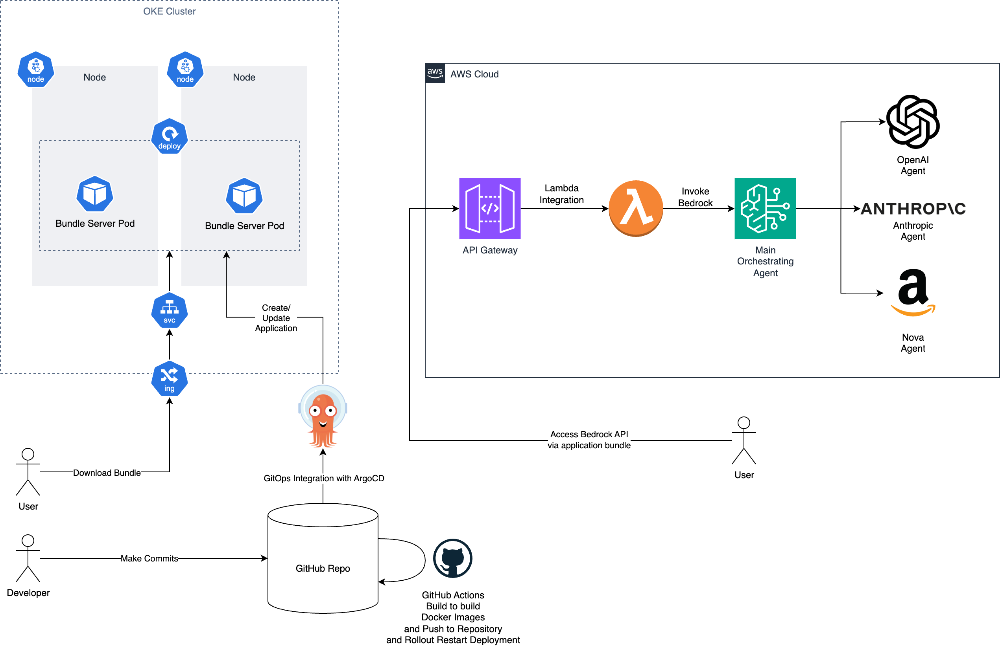

# Hackermen
Developers: [George Tay](https://github.com/georgetayqy), [Phua Zai Lian](https://github.com/pzl111), [Sebastian Tay](https://github.com/Sebtey) , [Tham You Wei](https://github.com/tyouwei)

## Introduction
In this hackathon, we are working on **Topic 4: Building UI for the AI Era with Lynx**.

The development tools that we used to build this project are:

- VSCode
- Github
- GitHub Actions
- Amazon Bedrock
- ArgoCD
- Docker
- Kubernetes

Libraries used:

- Lynx

## Installation

### Hosted Bundle Files

The hosted bundle files are available at the URL: [https://lynx.georgetay.com/main.lynx.bundle](https://lynx.georgetay.com/main.lynx.bundle).

Install the "Lynx Go" in your mobile devices, open the app and you can enter in the above URL into the Card URL field to see our app in action without having to setup AWS.

### Local Installation

To set up locally, git clone from this [repository](https://github.com/PSA-Hackermen/TechJam-Hackathon) into a local folder.

Following which, using the CLI, enter `cd ai-yapper-agent/` to change directory to `ai-yapper-agent/`.

Now, run the following commands in sequence to set up and run the project:

1. `npm install`

2. `npm run build`

3. `npm run dev` will run the project and show a QR code in the CLI which you can scan with Lynx Go, an application that you need to install from your mobile app store.

For the AWS bedrock API call, you will need to configure and setup your AWS Bedrock and update the API endpoint in `./ai-yapper-agent/src/hooks/useChat.ts`. Also, do add in your X_API_KEY that will be part of your fetch request in your `./ai-yapper-agent/.env` file under `PUBLIC_X_API_KEY`.

## Architecture

Our overall architecture looks as such:

We used ArgoCD in conjunction with GitHub and GitHub Actions for GitOps. When changes are made to the `main` branch, ArgoCD automatically applies the Helm charts onto our Oracle Kubernetes Engine cluster, updating our ArgoCD Application. GitHub Actions was also used to run a pipeline that builds the relevant Docker images, pushes it to Docker Hub, and triggers a rollout restart for the Kubernetes Deployment which serves the application bundle files on a commit on the `main` branch.

For our AI infrastructure, we used Amazon Bedrock, which powers our agentic AI workflows. We exposed the functionality of Bedrock via API Gateway with AWS Lambda Proxy Integration to directly invoke the Bedrock APIs securely with AWS IAM.

## Features

Our project seeks to integrate AI capabilities onto a Lynx project to build an AI chatbot.

Through this, we seek to showcase how AI can reshape user experiences particularly through Lynx.

We achieved this by leveraging on Amazon Bedrock, where we exposed an API that our Lynx project will call upon.

In Amazon Bedrock, we created a fanout architecture to save agent costs. User queries are passed on to the orchestrating agent in which, depending on the difficulty nature of the question, will be routed differently to other agents (e.g. difficult questions will be routed to gpt 5, trivial questions will be routed to gemini 2.5 flash, or coding questions will be routed to Claude 3.7 Sonnet).

This cuts down cost of hosting a chatbot service by a significant amount, and it could be helpful for TikTok's AMA chatbot for example.

On top of the integrated AI capabilities, our project, being built on top of Lynx as its UI stack, has the ability to run on various platforms such as IOS and Android.

## Video Demos

iOS: [https://youtube.com/shorts/fcIrcn-MDP4?feature=share](https://youtube.com/shorts/fcIrcn-MDP4?feature=share)

Android: [https://youtube.com/shorts/INKEYJAvDqE?si=UTYzdj96tNLY84HP](https://youtube.com/shorts/INKEYJAvDqE?si=UTYzdj96tNLY84HP)
